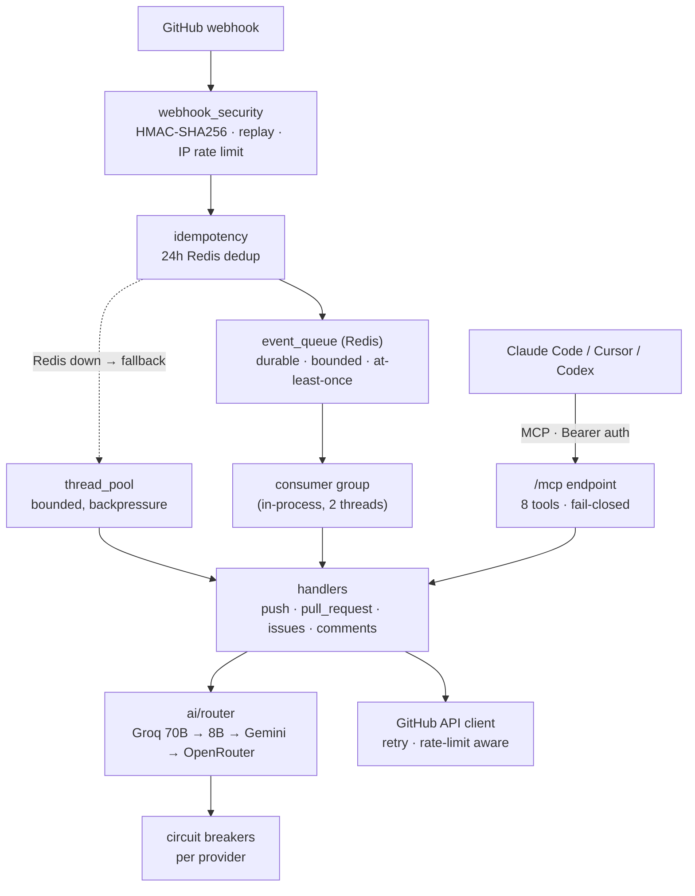

<div align="center">


# GitHub Autopilot

**Your repository's AI co-pilot. Fix bugs, review PRs, scan secrets — from a single comment.**

[](https://github.com/Shweta-Mishra-ai/github-autopilot/actions/workflows/ci.yml)
[](https://python.org)
[](tests/)
[](docs/mcp-setup.md)
[](LICENSE)
[](https://render.com/deploy)
[](https://github.com/sponsors/Shweta-Mishra-ai)


</div>

---

## Why Autopilot?

| | |
|---|---|
| ⚡ **26 slash commands** | `/fix` `/security` `/merge` `/autofix` `/rollback` … right in issue/PR comments |
| 🛡️ **Safety-first automation** | Confidence gates, guardrails, human-in-the-loop `/apply`, maintainer-only permissions |
| 🔁 **Durable event queue** | Webhooks parked in Redis, survive restarts & deploys — no event ever silently lost |
| 🧠 **5-provider AI failover** | Groq 70B → Groq 8B → Gemini → OpenRouter, with per-provider circuit breakers |
| 🔒 **Local-LLM privacy mode** | Run on your own Ollama — set `LLM_LOCAL_ONLY=1` and code **never** leaves your infra |
| 🧩 **Private repo memory** | Learns your repo's fixes & decisions; sensitive context stays local, [encrypted backup](docs/ai-system/memory.md) for durability |
| 🔐 **Security scanning** | Secret detection on **every push to every branch**, dependency CVE checks |
| 🔌 **MCP server built in** | Call Autopilot tools from Claude Code, Cursor, or Codex — [setup guide](docs/mcp-setup.md) |
| 📊 **Live ops dashboard** | `/dashboard` — queue depth, event throughput, provider circuit-breakers, thread pool. Zero build, no CDN |
| 💸 **Runs on free tier** | Render free web service + free Redis. $0/month |

---

## Quickstart — deploy in 10 minutes

### 1. Create a GitHub App

1. **github.com/settings/apps** → New GitHub App
2. Webhook URL: `https://your-app.onrender.com/webhook`
3. Webhook secret: `python3 -c "import secrets; print(secrets.token_hex(32))"`
4. Permissions: Issues ✏️ · Pull requests ✏️ · Contents ✏️ · Actions ✏️
5. Subscribe to: Push · Pull request · Issue comment · Issues
6. Download the private key (`.pem`)

### 2. Deploy

[](https://render.com/deploy)

Or manually: fork this repo → Render → **New Blueprint** → connect fork ([render.yaml](render.yaml) does the rest).

### 3. Environment variables

| Variable | Where to get it | Required |
|----------|----------------|----------|
| `GITHUB_APP_ID` | App settings page (numeric ID) | ✅ |
| `GITHUB_PRIVATE_KEY` | Contents of the `.pem` file | ✅ |
| `GITHUB_WEBHOOK_SECRET` | The secret from step 1 | ✅ |
| `GROQ_API_KEY` | [console.groq.com](https://console.groq.com) — free | ✅ |
| `REDIS_URL` | Auto-wired by render.yaml | ✅ |
| `MCP_API_KEY` | `python3 -c "import secrets; print(secrets.token_hex(32))"` | for MCP |
| `METRICS_AUTH_TOKEN` | Any strong random string | recommended |
| `GEMINI_API_KEY` / `OPENROUTER_API_KEY` | Optional extra AI fallbacks | optional |

### 4. Install & verify

Install the GitHub App on your repos, then:

```bash
curl https://your-app.onrender.com/ping
# → {"status": "ok", "version": "5.0.0"}
```

Comment `/health` on any issue. The bot replies with a repo health grade. Done. ✈️

---

## Commands

Type any of these in a GitHub issue or PR comment:

| Command | Description | Who |
|---------|-------------|-----|
| `/fix` | AI bug fix with root cause + test | Anyone |
| `/explain` | Plain-English explanation | Anyone |
| `/improve` | Concrete improvement suggestions | Anyone |
| `/test` | Generate pytest test cases | Anyone |
| `/docs` | Generate docstrings + README section | Anyone |
| `/refactor` | Refactoring with before/after | Anyone |
| `/perf` | Performance analysis (O(n²), N+1, …) | Anyone |
| `/gaps` | Test coverage gap analysis | Anyone |
| `/arch` | Architecture review | Anyone |
| `/ci` | Analyze CI failure | Anyone |
| `/security` | Secret + dependency scan on PR | Anyone |
| `/secfull` | Full repo security scan | Maintainers |
| `/health` | Repo health grade | Anyone |
| `/version` | Tags, releases, recent commits | Anyone |
| `/summarize` | Summarize issue thread | Anyone |
| `/budget` | Today's AI token usage | Anyone |
| `/report` | Weekly analytics | Anyone |
| `/changelog` | Generate CHANGELOG entry | Anyone |
| `/impact` | PR blast radius analysis | Anyone |
| `/merge` | Merge PR after checks pass | Maintainers |
| `/apply` | Open PR from autofix branch | Maintainers |
| `/rollback N` | Restore to snapshot N | Maintainers |
| `/release` | Draft GitHub release | Maintainers |
| `/runtests` | Trigger CI workflow | Maintainers |
| `/notify` | Send Discord/Slack alert | Maintainers |
| `/autofix` | Auto-apply code improvements (human-confirmed via `/apply`) | Maintainers |

---

## Architecture



**The queue is the backbone.** Every webhook is parked in Redis *before* the
`202` ACK, then consumed by an in-process worker group:

- **Durable** — deploys/restarts/crashes don't lose events; stranded work is requeued at boot, poison events dead-letter after 2 attempts
- **Bounded** — queue capped at 200 events, envelopes at 512KB, dead-letter at 50: nothing grows unbounded on a 512MB / 25MB-Redis free tier
- **Backpressured** — queue full → `503` → GitHub redelivers automatically
- **Degradable** — Redis down → automatic fallback to the bounded thread pool (reduced durability, still working)
- **Scale-ready** — need more throughput later? Run [`worker.py`](worker.py) as a Render worker service and set `EVENT_QUEUE_CONSUMERS=0` on web. Zero code changes.

**Other key decisions:**

- Idempotency keys live 24h — matches GitHub's webhook retry window
- Redis runs `noeviction` — dedup/queue keys are never silently evicted
- MCP + `/metrics` auth fail **closed** with constant-time compares
- Secret scanning runs on all branches, not just main
- Confidence gates: every automated action needs a per-action threshold (e.g. auto-merge ≥ 0.95)

---

## Use it from your IDE (MCP)

Autopilot ships an MCP server — analyze PRs, scan secrets, and generate tests
from Claude Code, Cursor, or Codex without leaving your editor:

```bash
claude mcp add --transport http github-autopilot \
  https://your-app.onrender.com/mcp \
  --header "Authorization: Bearer YOUR_MCP_API_KEY"
```

Full client configs, tool reference, and troubleshooting: **[docs/mcp-setup.md](docs/mcp-setup.md)**

---

## Use it from your IDE (Claude Code plugin)

Install the commands + MCP server in one step:

```
/plugin marketplace add Shweta-Mishra-ai/github-autopilot
/plugin install github-autopilot
```

Point it at your deployed instance:

```bash
export GITHUB_AUTOPILOT_URL="https://your-app.onrender.com/mcp"
export MCP_API_KEY="<your server's MCP_API_KEY>"
```

Then, from Claude Code: `/github-autopilot:review owner/repo 42` ·
`/github-autopilot:fix owner/repo 17` · `/github-autopilot:security file.py` ·
`/github-autopilot:health owner/repo`. Full details in [`plugin/README.md`](plugin/README.md).

---

## Private mode — keep code on your own hardware

By default the bot sends code to Groq/Gemini/OpenRouter. For private or
regulated repos, point it at a local [Ollama](https://ollama.com) instead —
source code never leaves your infrastructure:

```bash
ollama pull llama3.1:8b
```

```bash
OLLAMA_HOST=http://localhost:11434
OLLAMA_MODEL=llama3.1:8b
LLM_LOCAL_ONLY=1     # Ollama or nothing — no cloud provider is ever contacted
# LLM_PREFER_LOCAL=1 # softer: try local first, fall back to cloud on failure
```

In `LLM_LOCAL_ONLY` mode the router **fails closed** — if Ollama is down, calls
error out rather than silently leaking to a cloud API. `cost_usd` is always `0`.

---

## Configuration

Drop `.ai-repo-manager.yml` in your repo root:

```yaml
push:
  scan_secrets: true          # always on for all branches
  scan_dependencies: true

confidence:
  thresholds:
    auto_merge: 0.95
    fix_command: 0.75

commands:
  permissions:
    maintainer_only: [merge, rollback, release]

bot:
  footer: "*Powered by GitHub Autopilot*"
```

All keys are validated on load — bad values log a warning and fall back to safe defaults.

---

## Local development

```bash
git clone https://github.com/Shweta-Mishra-ai/github-autopilot.git
cd github-autopilot
python -m venv .venv && source .venv/bin/activate
pip install -r requirements-dev.txt
cp .env.example .env          # fill in your credentials
python server.py
```

```bash
pytest tests/ -v              # 695 tests
ruff check app/               # lint
```

---

## Security model

- **Fail closed everywhere it matters**: unset webhook secret → boot refuses; unset `MCP_API_KEY` → MCP returns 503; token compares are constant-time
- HMAC-SHA256 signature verification on every webhook, replay + IP rate limiting (spoof-resistant)
- Autofix cannot touch CI workflows, Dockerfiles, env files, or security modules (path allowlist + prefix blocklist + traversal guard); changes require human `/apply`
- Optional `MCP_ALLOWED_INSTALLATIONS` allowlist for tenant isolation
- Bot-loop prevention on all event handlers
- Prompt-injection mitigation: input sanitization + delimiter-wrapped user content

Found a vulnerability? Please email rather than opening a public issue.

---

## Changelog

### V6 (unreleased)
- **Durable Redis event queue** — webhooks survive restarts; bounded, at-least-once, dead-letter, thread-pool fallback
- **Fail-closed MCP auth** + constant-time token compares + installation allowlist
- Version single source of truth; config cross-tenant leak fixed; dead code purged
- Pro README, logo, animated demo, MCP setup guide

### V5.0.0
- `comments.py` → `comments/` package (5 focused modules)
- Redis connection pooling, secret scanning on all branches
- LLM circuit breakers with automatic failover
- MCP server for IDE integrations · per-repo YAML config

---

## Support

GitHub Autopilot is free and open source, built and maintained by one person.
If it saves your team time, consider sponsoring — it funds the free-tier hosting
and keeps development going:

<div align="center">

[](https://github.com/sponsors/Shweta-Mishra-ai)

</div>

---

<div align="center">

Built by [Shweta Mishra](https://github.com/Shweta-Mishra-ai) · MIT License

⭐ Star this repo if Autopilot saved you time!

</div>
