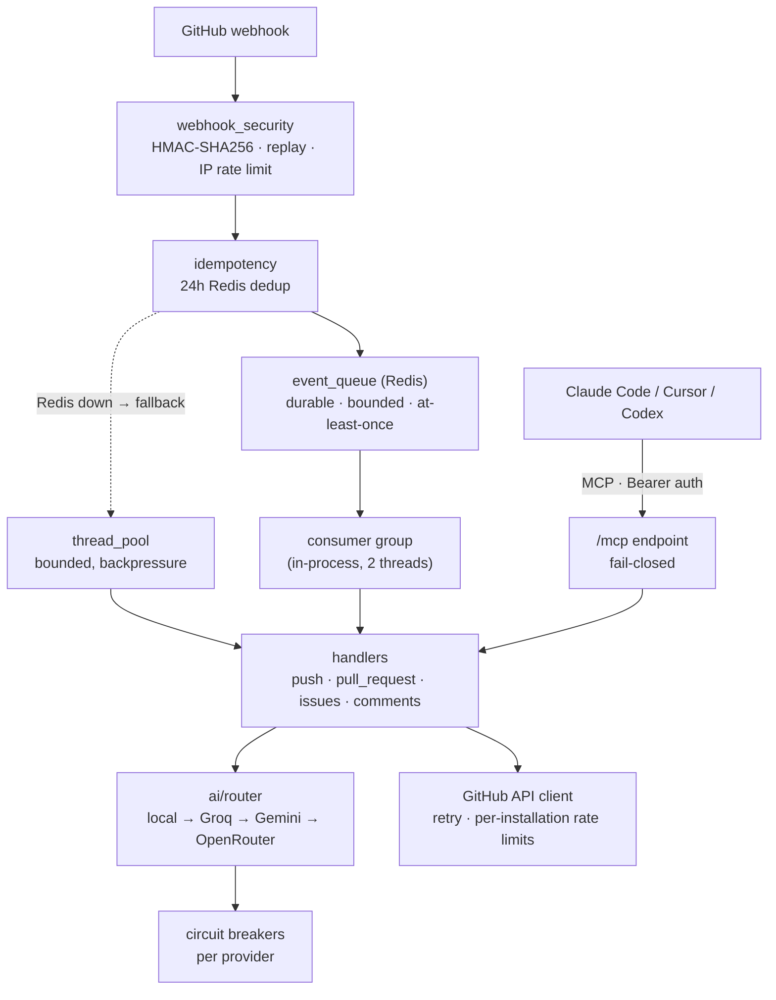
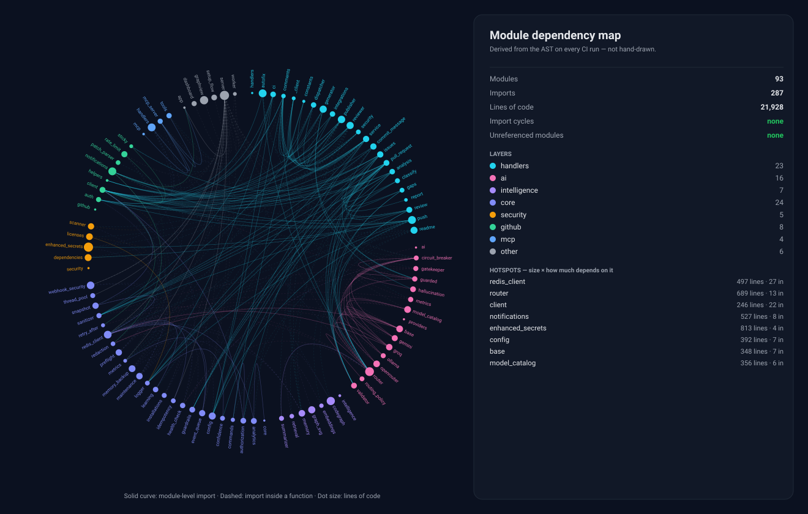

<div align="center">


# GitHub Autopilot

### AI code review that never sends your code anywhere.

**Self-hosted. Runs on your own infrastructure, or entirely on your own hardware.**<br/>
Reviews pull requests, fixes bugs, scans for secrets — from a comment, your terminal, or your editor.

[](https://github.com/Shweta-Mishra-ai/github-autopilot/actions/workflows/ci.yml)
[](https://github.com/Shweta-Mishra-ai/github-autopilot/actions/workflows/ci.yml)
[](https://github.com/Shweta-Mishra-ai/github-autopilot/actions/workflows/keepalive.yml)
[](https://python.org)
[](docs/mcp-setup.md)
[](LICENSE)
[](https://github.com/sponsors/Shweta-Mishra-ai)


<sub>*Illustration. Real behaviour is measured by the [eval suite](evals/), which runs nightly against planted bugs.*</sub>

</div>

---

## Why this one

Most AI review bots are a service you send your code to. This one is a service you run.

| | |
|---|---|
| 🔒 **Your code can stay on your hardware** | Point it at a local [Ollama](https://ollama.com) and set `LLM_LOCAL_ONLY=1`. The router then **fails closed**: if the local model is down, calls error out rather than quietly falling back to a cloud API. There is deliberately no setting that weakens this. |
| 🧩 **It lives where you already work** | A built-in MCP server and a Claude Code plugin, not just a bot that comments on pull requests. Review a PR from your terminal without opening a browser. |
| 📊 **Its quality is measured, not asserted** | A nightly [eval suite](evals/) scores the bot against known bugs and opens an issue when the score drops. Every comment it posts also discloses which model wrote it. |
| 🛑 **It says nothing rather than something wrong** | Low-confidence output is withheld with an honest message. Unparseable model responses are never rendered as findings. Silence is a supported answer. |
| 🏗️ **Built to be operated** | Durable Redis-backed webhook queue, per-provider circuit breakers, a live ops dashboard, and a `/setup/doctor` endpoint that tells you exactly which command will not work and why. |
| 💸 **Free to run** | Fits the Render free tier with free Redis, and a free Groq key. $0/month, or $0 and no third party at all in local mode. |

---

## Get started

Four ways in, shortest first. The first two are clients; the last two are the
deployment they talk to, and you pick one of those.

**Which deployment?** The only difference is where the model runs.

| | Option 3 — hosted | Option 4 — your own hardware |
|---|---|---|
| Model | Groq, Gemini or OpenRouter | Ollama, on your machine |
| Your code | goes to that provider | never leaves the box |
| Needs | a free API key | ~6GB RAM for an 8B model |
| Speed | seconds | tens of seconds on CPU |
| Cost | $0 on free tiers | $0, and no third party |

Both are one command and both are fully supported. Option 4 is the reason this
project exists; Option 3 is the one to start with if you just want to see it work.

### Option 1 — From Claude Code, in about ten seconds

```
/plugin marketplace add Shweta-Mishra-ai/github-autopilot
/plugin install github-autopilot
```

Then point it at an instance and use it:

```bash
export GITHUB_AUTOPILOT_URL="https://your-deployment.onrender.com/mcp"
export MCP_API_KEY="<your server's MCP_API_KEY>"
```

```
/github-autopilot:review owner/repo 42
/github-autopilot:fix owner/repo 17
/github-autopilot:security file.py
/github-autopilot:health owner/repo
```

Details in [`plugin/README.md`](plugin/README.md).

### Option 2 — From any MCP editor

Claude Code, Cursor and Codex all speak MCP. One command:

```bash
claude mcp add --transport http github-autopilot \
  https://your-deployment.onrender.com/mcp \
  --header "Authorization: Bearer YOUR_MCP_API_KEY"
```

Client configs, the full tool reference, and troubleshooting:
**[docs/mcp-setup.md](docs/mcp-setup.md)**

### Option 3 — Hosted, as a GitHub App, in about ten minutes

<details open>
<summary><b>Full deployment walkthrough</b></summary>

<br/>

**1. Deploy.**

[](https://render.com/deploy)

Or fork this repository, then Render → **New Blueprint** → connect the fork.
[`render.yaml`](render.yaml) wires up the web service and Redis for you.

**2. Create the GitHub App with one click.**

Open `https://<your-deployment>/setup` and press the button. GitHub builds the
App from a manifest that already has the webhook URL, the four event
subscriptions and every permission set. Nothing to tick — which matters,
because a missed permission is the one mistake that makes commands refuse to
run and struggle to explain why.

The credentials are shown once. Put them in your host's environment:

| Variable | Where it comes from |
|----------|---------------------|
| `GITHUB_APP_ID` | the setup page |
| `GITHUB_PRIVATE_KEY` | the setup page |
| `GITHUB_WEBHOOK_SECRET` | the setup page |
| `GROQ_API_KEY` | [console.groq.com](https://console.groq.com), free — **or skip it and use Option 4 instead** |
| `REDIS_URL` | wired automatically by `render.yaml` |
| `METRICS_AUTH_TOKEN` | any strong random string — recommended |
| `MCP_API_KEY` | `python3 -c "import secrets; print(secrets.token_hex(32))"` |

<details>
<summary>Prefer to create the App by hand?</summary>

<br/>

**github.com/settings/apps** → New GitHub App

- Webhook URL: `https://<your-deployment>/webhook`
- Webhook secret: `python3 -c "import secrets; print(secrets.token_hex(32))"`
- Repository permissions: Issues ✏️ · Pull requests ✏️ · Contents ✏️ ·
  Actions ✏️ · Metadata 👁 · Checks 👁 · Code scanning alerts 👁
- Subscribe to: Push · Pull request · Issues · Issue comment
- Generate and download the private key (`.pem`)

The `/setup` flow exists because this list is easy to get subtly wrong. If you
do it by hand, run the doctor below afterwards.

</details>

**3. Install it, then ask the deployment to check itself.**

```bash
curl -H "Authorization: Bearer $METRICS_AUTH_TOKEN" \
  "https://<your-deployment>/setup/doctor?repo=owner/name&installation_id=<id>"
```

Every capability is probed with a real read, and the reply names **which
commands will not work, and why**. The installation id is in the URL of the
App's installation settings page.

Called with no arguments it reports the settings that fail *silently* when
unset — encrypted memory backup, the local triage gate, and whether
`TRUSTED_PROXY_HOPS` matches the forwarding chains your traffic actually
carries.

Then comment `/health` on any issue. The bot replies with a repository health
grade, and you are done. ✈️

</details>

### Option 4 — Entirely on your own hardware, in about ten minutes

<details open>
<summary><b>Nothing leaves the machine, including the model</b></summary>

<br/>

Same application, same commands, same GitHub App. The model runs next to it in
a container instead of at a provider, so no source code is sent anywhere.

**1. Get the GitHub App credentials.** Identical to Option 3, steps 1–2 — you
still need `GITHUB_APP_ID`, `GITHUB_PRIVATE_KEY` and `GITHUB_WEBHOOK_SECRET`.
Run `/setup` on any temporary deployment, or create the App by hand.

**2. Write `.env`.** No model key appears here:

```bash
GITHUB_APP_ID=...
GITHUB_PRIVATE_KEY=...
GITHUB_WEBHOOK_SECRET=...

OLLAMA_HOST=http://ollama:11434   # the compose service, not localhost
OLLAMA_MODEL=llama3.1:8b
LLM_LOCAL_ONLY=1                  # Ollama or nothing

MCP_API_KEY=...                   # python3 -c "import secrets; print(secrets.token_hex(32))"
METRICS_AUTH_TOKEN=...            # any strong random string
```

`localhost` inside a container is the container. `http://ollama:11434` is the
service name from [`docker-compose.yml`](docker-compose.yml), which is what
reaches the model.

**3. Start it and fetch the model.**

```bash
docker compose --profile local up -d
docker compose exec ollama ollama pull llama3.1:8b
```

That is the whole deployment: web, worker, Redis and Ollama. Without
`--profile local` the Ollama container is not started and not downloaded, so
Option 3 users never pay for it.

**4. Let GitHub reach it.** A webhook needs a public URL. Put it behind your
own reverse proxy, or tunnel it while you try things out:

```bash
cloudflared tunnel --url http://localhost:8000    # or: ngrok http 8000
```

Set that URL as the App's webhook URL and as `PUBLIC_URL`.

**5. Confirm it is actually local.**

```bash
curl -H "Authorization: Bearer $METRICS_AUTH_TOKEN" http://localhost:8000/health
```

Then comment `/health` on an issue. Every comment the bot posts names the model
that wrote it, so `llama3.1:8b` in the footer is the deployment telling you the
cloud was not involved.

> **Speed, honestly.** An 8B model on CPU takes tens of seconds for a review
> where Groq takes a few. It is the same pipeline and the same prompts, and the
> findings are shallower than a frontier model's. If the machine has a GPU, add
> a device reservation to the `ollama` service and the gap closes considerably.

</details>

> **On cold starts.** The demo instance is on Render's free tier. A scheduled
> [keep-alive workflow](.github/workflows/keepalive.yml) pings it every ten
> minutes, and the badge above turns red if production is genuinely down. If a
> ping window is missed, the first request can take around 50 seconds while the
> instance wakes. Retry once.

---

## Keep your code on your own hardware

This is the reason the project exists. **Option 4 above is how you do it**;
this is what the guarantee actually means, and how it is held to.

Already running against a model on your own machine or network? The three
settings are all there is:

```bash
OLLAMA_HOST=http://localhost:11434   # http://ollama:11434 from inside compose
OLLAMA_MODEL=llama3.1:8b
LLM_LOCAL_ONLY=1     # Ollama or nothing. No cloud provider is ever contacted.
# LLM_PREFER_LOCAL=1 # Softer: try local first, fall back to cloud on failure.
```

Three guarantees worth being precise about:

- **`LLM_LOCAL_ONLY=1` fails closed.** If Ollama is unreachable, the call
  errors. It does not silently reach for a cloud provider, on the first attempt
  or on any fallback path, and there is no configuration that relaxes this.
- **Learned repository memory is local by default.** Recalled context is only
  injected into a prompt when a local model is active, unless you explicitly set
  `MEMORY_ALLOW_CLOUD=1` and accept the egress.
- **The promise is tested, not asserted.**
  [`tests/test_privacy_no_egress.py`](tests/test_privacy_no_egress.py) sets
  every cloud credential, enables `LLM_LOCAL_ONLY`, points Ollama at a dead
  port — the exact conditions a fallback would trigger in — and records every
  address the process attempts, across `ask`, `safe_ask`, `ask_text` and five
  task types. Mocking the provider would only prove the mock stays home, so
  nothing is mocked. One of those tests is a control that turns the guarantee
  off and *requires* egress to be observed, because a watcher that sees nothing
  passes a privacy test for the wrong reason.

Reported cost in local mode is always `0`.

---

## At a glance

<!-- autopilot:stats:start -->
| | |
|---|---|
| Modules | 94 |
| Lines of code | 22,521 |
| Slash commands | 27 |
| MCP tools | 9 |
| Internal imports | 292 |
<!-- autopilot:stats:end -->

<sub>Regenerated from the code by CI — see [managed README sections](#managed-readme-sections).</sub>

---

## Commands

**27 slash commands**, typed straight into a GitHub issue or pull request
comment. Anything that writes to your repository is restricted to maintainers,
and anything irreversible asks for confirmation first.

| Command | What it does | Who can run it |
|---------|--------------|----------------|
| `/fix` | AI bug fix with root cause and a test | Anyone |
| `/explain` | Plain-English explanation | Anyone |
| `/improve` | Concrete improvement suggestions | Anyone |
| `/test` | Generate pytest cases | Anyone |
| `/docs` | Generate docstrings and a README section | Anyone |
| `/refactor` | Refactoring with before and after | Anyone |
| `/perf` | Performance analysis — O(n²), N+1, and similar | Anyone |
| `/gaps` | Test coverage gap analysis | Anyone |
| `/arch` | Architecture review | Anyone |
| `/ci` | Analyse a CI failure | Anyone |
| `/security` | Secret and dependency scan on a PR | Anyone |
| `/secfull` | Full repository scan plus licence compliance | Maintainers |
| `/health` | Repository health grade | Anyone |
| `/version` | Tags, releases, recent commits | Anyone |
| `/summarize` | Summarise an issue thread | Anyone |
| `/budget` | Today's AI token usage | Anyone |
| `/report` | Weekly analytics | Anyone |
| `/changelog` | Generate a CHANGELOG entry | Anyone |
| `/impact` | Pull request blast radius | Anyone |
| `/merge` | Merge a PR once checks pass | Maintainers |
| `/apply` | Open a PR from an autofix branch | Maintainers |
| `/rollback N` | Restore to snapshot N | Maintainers |
| `/release` | Draft a GitHub release | Maintainers |
| `/runtests` | Trigger a CI workflow | Maintainers |
| `/notify` | Send a Discord or Slack alert | Maintainers |
| `/ignore <rule>` | Teach the bot to stop flagging a pattern here | Maintainers |
| `/autofix` | Auto-apply changes, confirmed by a human via `/apply` | Maintainers |

**[Full command reference →](docs/COMMANDS.md)** — syntax, arguments, scope,
the access model, and what to check when a command does not respond.

---

## Architecture



### The real dependency graph

The diagram above is the request flow, drawn by hand. The one below is not
drawn at all — it is generated from the import graph on every CI run, so it
cannot drift from the code:



Every module sits on the ring, grouped by layer and marked by a coloured band.
Each curve is one import; dashed curves are imports made inside a function
body, which this codebase uses deliberately to break cycles. Dot size is lines
of code.

**Read the panel, not the middle.** A chord diagram draws every edge, and past
roughly fifty the centre is texture — all 292 imports are in there and not one
of them can be traced from dot to dot. So the panel answers the question the
picture cannot: which layers actually touch, and how hard. `handlers → core` at
45 is expected; `core → github` at 9 is the sort of thing worth knowing about
your own architecture, and it was invisible in the hairball.

The panel also reports the three things that are defects rather than facts —
import cycles, modules nothing imports, and two files claiming one import path
— and CI fails the build if any of them appears.

It is a committed file, so it needs no deployment, no token and no JavaScript.
What you are looking at is the structure at this commit. To explore it
interactively — click a node and see exactly what imports it — use
[`/graph`](#codebase-map).

<details>
<summary><b>The same graph as mermaid</b>, collapsed to one box per layer</summary>

<br/>

Useful where an image is not: a diff, a terminal, a pull request comment.
Regenerate either form with
`python -m app.intelligence.codegraph app server.py worker.py`.

<!-- autopilot:architecture:start -->

<!-- autopilot:architecture:end -->

</details>

**The queue is the backbone.** Every webhook is parked in Redis *before* the
`202` acknowledgement, then consumed by an in-process worker group:

- **Durable** — deploys, restarts and crashes do not lose events. Stranded work
  is requeued at boot; poison events dead-letter after two attempts.
- **Bounded** — 200 events, 512KB per envelope, 50 dead-lettered. Nothing grows
  without limit on a 512MB instance with 25MB of Redis.
- **Backpressured** — a full queue returns `503`, and GitHub redelivers.
- **Degradable** — if Redis dies, it falls back to the bounded thread pool with
  reduced durability, and says so in the logs.
- **Scale-ready** — run [`worker.py`](worker.py) as a separate service and set
  `EVENT_QUEUE_CONSUMERS=0` on web. No code changes.

**Other decisions worth knowing:**

- Idempotency keys live 24 hours, matching GitHub's webhook retry window.
- Redis runs `noeviction`, so dedup and queue keys are never silently dropped.
- MCP and `/metrics` authentication fail **closed**, with constant-time compares.
- Secret scanning runs on every branch, not only the default one.
- Nothing may sleep in a shared worker thread. Provider throttling and GitHub
  rate limits are both ridden out only if the wait is short, and reported
  otherwise.
- Rate-limit state is tracked **per installation**, so one busy tenant cannot
  throttle another or mask its exhaustion.

---

## Configuration

Drop `.ai-repo-manager.yml` in your repository root. The filename predates the
rename to GitHub Autopilot and is kept so existing installs keep working.

```yaml
push:
  scan_secrets: true          # always on, for every branch
  scan_dependencies: true

confidence:
  thresholds:
    auto_merge: 0.95
    fix_command: 0.75

commands:
  permissions:
    maintainer_only: [merge, rollback, release]
  enabled: [fix, explain, health]   # optional allow-list; omit to keep all

bot:
  enabled: true               # master kill switch — false stops everything
  footer: "*Powered by GitHub Autopilot*"
```

Every key is validated on load. A bad value logs a warning and falls back to a
safe default.

**Configuration is read from your default branch, never from a pull request.**
This is deliberate. Config decides who may merge, whether auto-merge runs, and
whether secrets are scanned — so honouring it from a PR head would let any
contributor grant themselves those rights by editing the file inside their own
pull request. Changes take effect once merged, which is the same trust boundary
GitHub Actions applies to workflow permissions.

Two behaviours worth knowing:

- Omitting `commands.enabled` means **no restriction**, not "none enabled". It
  is an allow-list, not a registry, so you never have to keep it in sync with
  new releases. An explicit `enabled: []` disables everything.
- `bot.enabled: false` stops every handler: pull requests, issues, pushes, CI
  and commands.

---

## Security model

- **Fail closed everywhere it matters.** No webhook secret, and boot refuses to
  start. No `MCP_API_KEY`, and the MCP endpoint returns 503. Token comparisons
  are constant-time.
- HMAC-SHA256 verification on every webhook, with replay protection and
  spoof-resistant per-IP rate limiting.
- Autofix cannot touch CI workflows, Dockerfiles, environment files or security
  modules — a path allow-list, a prefix blocklist and a traversal guard, all
  applied to one normalised spelling of the path. Changes still require a human
  `/apply`.
- Prompt-injection mitigation: input sanitisation plus delimiter-wrapped user
  content, with delimiter-shaped sequences inside that content escaped so it
  cannot close its own block.
- Oversized bodies are refused **while being read**, before any signature is
  verified, so a large unauthenticated request cannot exhaust memory first.
- Optional `MCP_ALLOWED_INSTALLATIONS` allow-list for tenant isolation, and MCP
  tools that read the filesystem are confined to the deployment's own source
  tree — an MCP key is not a key to the host.
- **The installation token only ever goes to GitHub.** Absolute URLs handed to
  the API client are checked against `api.github.com` by exact host match, so a
  URL that arrived in a webhook payload cannot carry a credential somewhere
  else.
- **No code-execution path.** The bot never runs untrusted repository code —
  no `eval`, `exec`, `subprocess` or `pickle` anywhere in `app/`. A malicious
  repository cannot execute anything on the host.

Two of those lines describe fixes, not long-standing properties: `gh_get` would
send the installation token to any host it was given, and the `codebase_map`
MCP tool honoured an undeclared `root` argument that pointed it at any
directory. Neither was reachable from outside — every call site built its own
path — and both are now closed and tested. They are listed here because a
security section that only lists wins is not one you should trust.

Full analysis: [reliability and isolation audit](docs/architecture/reliability-audit.md) ·
[September 2026 full audit](docs/architecture/audit-2026-09.md) ·
[roadmap](docs/architecture/roadmap.md).

Found a vulnerability? Please email rather than opening a public issue.

---

## Codebase map

The always-visible version is [in the architecture section
above](#the-real-dependency-graph) — a committed SVG that needs no server. For
exploring rather than reading, `/graph` serves an interactive, force-directed
view of the same data:

- **Click a node** to see exactly what imports it and what it imports.
- **Import cycles** are detected and flagged — they are what makes a module
  impossible to test on its own.
- **Unreferenced modules** are listed: nothing imports them, which usually
  means dead code.
- **Hotspots** rank modules by size multiplied by how much depends on them —
  the files that are expensive to change.

The data comes from `python -m app.intelligence.codegraph`, which reads the AST
and **never imports the code it analyses**, so it is safe to point at any
repository. CI regenerates both the data and the picture, and fails a pull
request whose committed copies are stale.

```bash
python -m app.intelligence.codegraph app server.py worker.py \
  --out docs/diagrams/codegraph.json \
  --svg docs/diagrams/codegraph.svg
```

`/graph.json` is gated with `METRICS_AUTH_TOKEN`, the same as `/health`, because
a dependency graph is a map of the whole system. The page asks for that token
only after a request has actually been refused, so an unauthenticated
deployment never interrogates a visitor for a secret that does not exist, and a
reader without one is pointed at the committed SVG instead of a dead end. The
same data reaches your editor through the `codebase_map` MCP tool.

---

## Managed README sections

Some facts in this file restate what the code already knows: module counts, the
command registry, the dependency graph. Those rot silently — this README
claimed the MCP endpoint had "8 tools" for exactly as long as it took someone to
add a ninth.

Blocks between `autopilot` markers are regenerated from the code. Paste an empty
pair wherever you want the content:

```markdown
<!-- autopilot:NAME:start -->
<!-- autopilot:NAME:end -->
```

Available regions: `stats`, `architecture`, `commands`. Everything outside a
marker pair is hand-written and never touched, and a repository with no markers
gets no edits at all — you opt in one region at a time.

Refreshes arrive as a pull request, never as a direct commit to the default
branch. Set `README_SELF_UPDATE_REPO=owner/repo` to enable it for the
deployment's own repository.

---

## Local development

```bash
git clone https://github.com/Shweta-Mishra-ai/github-autopilot.git
cd github-autopilot
python -m venv .venv && source .venv/bin/activate
pip install -r requirements-dev.txt
cp .env.example .env          # fill in your credentials
python server.py
```

**Before you push**, run every gate CI runs, with CI's exact flags:

```bash
./scripts/verify.sh           # lint, tests twice, generated files
./scripts/verify.sh fast      # lint + one test run, skips regeneration
```

The gates are spread across five CI jobs and each has flags that matter. Ruff
lints `app/` only, the suite runs twice because parts of it are randomised, and
two files are generated — so a stale README region or codebase map fails the
build for a reason that is invisible in the diff.

**After you deploy**, check the running service rather than the code:

```bash
BASE_URL=https://your-app.onrender.com METRICS_AUTH_TOKEN=... \
  ./scripts/verify-deployment.sh owner/repo <installation_id>
```

It reports whether the deployment answers, whether the provider still serves the
model ids it asks for, and which App capabilities are missing. Every call is a
read; nothing it does changes anything. A green test suite cannot tell you any
of it — a retired model id once took every AI command down while CI stayed
green.

---

## Changelog

Every release, with the reasoning behind each change:
**[CHANGELOG.md](CHANGELOG.md)**.

Latest is **v7.2.0**, a full-codebase audit. Seven commands were silently
refusing to run, the secret scanner reported its own ruleset as a leak, an
unauthenticated request could exhaust memory before being rejected, and several
features had been written, tested, merged and then never wired to anything. All
fixed, each with a structural gate so the class of defect fails the build rather
than shipping quietly.

Upgrading from V6? **[docs/MIGRATING.md](docs/MIGRATING.md)** — V7 changed three
visible behaviours: one sticky pull request comment instead of six, secret
issues only for critical and high severity, and silence when there is nothing to
say.

---

## Contributing

Pull requests are welcome. [CONTRIBUTING.md](CONTRIBUTING.md) covers the
development setup, test commands and coding conventions.

Before opening a pull request, `./scripts/verify.sh` must pass. CI runs Python
3.10, 3.11 and 3.12.

---

## License

Dual-licensed under **either** of:

- **MIT** — [LICENSE-MIT](LICENSE-MIT)
- **Apache-2.0** — [LICENSE-APACHE](LICENSE-APACHE)

at your option. SPDX: `MIT OR Apache-2.0`

You only need to satisfy one, whichever your organisation prefers. MIT is short
and widely pre-approved; Apache-2.0 adds an explicit patent grant that some
corporate legal teams require before approving a dependency. Offering both means
neither requirement blocks adoption.

Contributions are accepted under the same dual licence — see [LICENSE](LICENSE).

---

## Support

Free and open source. If you would like to support development, sponsorship is
available through [GitHub Sponsors](https://github.com/sponsors/Shweta-Mishra-ai)
and is entirely optional.

---

<div align="center">

Built by [Shweta Mishra](https://github.com/Shweta-Mishra-ai) · Licensed under MIT OR Apache-2.0

⭐ Star this repository if Autopilot saved you time.

</div>
