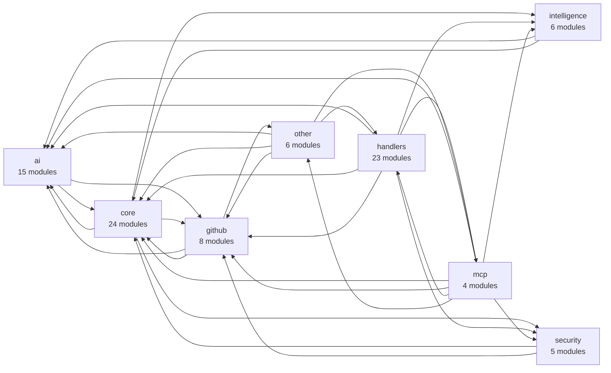

<div align="center">


# GitHub Autopilot

**Your repository's AI co-pilot. Fix bugs, review PRs, scan secrets — from a single comment.**

**The self-hosted one**: runs on your own free-tier infra, and in
[local-LLM mode](#private-mode--keep-code-on-your-own-hardware) your code
**never leaves your hardware** — the private-repo alternative to SaaS review bots.

[](https://github.com/Shweta-Mishra-ai/github-autopilot/actions/workflows/ci.yml)
[](https://python.org)
[](https://github.com/Shweta-Mishra-ai/github-autopilot/actions/workflows/ci.yml)
[](https://github.com/Shweta-Mishra-ai/github-autopilot/actions/workflows/keepalive.yml)
[](docs/mcp-setup.md)
[](LICENSE)
[](https://render.com/deploy)
[](https://github.com/sponsors/Shweta-Mishra-ai)



<sub>*Simulated output for illustration — see the [eval suite](evals/) for measured behaviour.*</sub>

</div>

---

## Upgrading from V6?

V7 changed three visible behaviours — one sticky PR comment instead of six,
secret issues only for critical/high, and silence when there is nothing to say.
All of it, plus the V7.1 and V7.2 notes: **[docs/MIGRATING.md](docs/MIGRATING.md)**.

## Why Autopilot?

| | |
|---|---|
| ⚡ **27 slash commands** | `/fix` `/security` `/merge` `/autofix` `/rollback` … right in issue/PR comments |
| 🛡️ **Safety-first automation** | Confidence gates, guardrails, human-in-the-loop `/apply`, maintainer-only permissions |
| 🔁 **Durable event queue** | Webhooks parked in Redis — survive restarts, deploys and crashes; if Redis itself dies, degrades to best-effort in-process dispatch (and says so in the logs) |
| 🧠 **5-provider AI failover** | Groq 70B → Groq 8B → Gemini → OpenRouter, with per-provider circuit breakers |
| 🔒 **Local-LLM privacy mode** | Run on your own Ollama — set `LLM_LOCAL_ONLY=1` and code **never** leaves your infra |
| 🧩 **Private repo memory** | Learns your repo's fixes & decisions; sensitive context stays local, [encrypted backup](docs/ai-system/memory.md) for durability |
| 🔐 **Security scanning** | Secret detection on **every push to every branch**, dependency CVE checks |
| 📍 **Inline PR reviews** | Findings land as line-anchored review comments with committable suggestions — not a wall-of-text comment |
| 📏 **Honest AI output** | Every comment discloses which model wrote it; optional [quality floor](#configuration) refuses to degrade reviews to a small model; [measured by evals](evals/), not vibes |
| 🔌 **MCP server built in** | Call Autopilot tools from Claude Code, Cursor, or Codex — [setup guide](docs/mcp-setup.md) |
| 📊 **Live ops dashboard** | `/dashboard` — queue depth, event throughput, provider circuit-breakers, thread pool. Zero build, no CDN |
| 💸 **Runs on free tier** | Render free web service + free Redis. $0/month |

---

## Quickstart — deploy in 10 minutes

### 1. Deploy

[](https://render.com/deploy)

Or: fork this repo → Render → **New Blueprint** → connect the fork.
[`render.yaml`](render.yaml) wires the web service and Redis.

### 2. Create the GitHub App — one click

Open **`https://<your-deployment>/setup`** and press the button.

GitHub creates the App from a manifest with the webhook URL, the four events
and every permission already set, then hands back your credentials. There is
nothing to tick, which matters: a missed permission is the one mistake that
makes commands refuse to run and struggle to say why.

The credentials appear once. Paste them into your host's environment:

| Variable | From |
|----------|------|
| `GITHUB_APP_ID` | the setup page |
| `GITHUB_PRIVATE_KEY` | the setup page |
| `GITHUB_WEBHOOK_SECRET` | the setup page |
| `GROQ_API_KEY` | [console.groq.com](https://console.groq.com) — free |
| `REDIS_URL` | auto-wired by `render.yaml` |
| `METRICS_AUTH_TOKEN` | any strong random string — recommended |
| `MCP_API_KEY` | `python3 -c "import secrets; print(secrets.token_hex(32))"` — for IDE use |

<details>
<summary>Prefer to create the App by hand?</summary>

<br/>

**github.com/settings/apps** → New GitHub App

- Webhook URL: `https://<your-deployment>/webhook`
- Webhook secret: `python3 -c "import secrets; print(secrets.token_hex(32))"`
- Repository permissions: Issues ✏️ · Pull requests ✏️ · Contents ✏️ ·
  Actions ✏️ · Metadata 👁 · Checks 👁 · Code scanning alerts 👁
- Subscribe to: Push · Pull request · Issues · Issue comment
- Generate and download the private key (`.pem`)

The `/setup` flow exists because this list is easy to get subtly wrong. If you
do it by hand, run the doctor below afterwards.

</details>

### 3. Install & verify

Install the App on your repositories, then ask the deployment to check itself:

```bash
curl -H "Authorization: Bearer $METRICS_AUTH_TOKEN" \
  "https://<your-deployment>/setup/doctor?repo=owner/name&installation_id=<id>"
```

It probes each capability with a real read and reports **which commands will
not work and why** — including the App-permission failure that used to be
invisible. `installation_id` is in the URL of the App's installation settings
page.

It also reports the deployment settings that fail *quietly* when unset —
encrypted memory backup, the local triage gate, and whether
`TRUSTED_PROXY_HOPS` matches the X-Forwarded-For chains your traffic actually
carries. Those need no repository, so the doctor answers with them even
without arguments:

```bash
curl -H "Authorization: Bearer $METRICS_AUTH_TOKEN" \
  "https://<your-deployment>/setup/doctor"
```

Then comment `/health` on any issue. The bot replies with a repo health grade.
Done. ✈️

> **Cold starts** — the demo instance runs on Render's free tier. A scheduled
> [keep-alive workflow](.github/workflows/keepalive.yml) pings it every 10 minutes
> to keep it warm (the badge above goes red if production is actually down), but if
> a ping window is missed the first request can take **~50 s** while the instance
> wakes. If a request stalls, retry once.

---

## At a glance

<!-- autopilot:stats:start -->
| | |
|---|---|
| Modules | 91 |
| Lines of code | 20,353 |
| Slash commands | 27 |
| MCP tools | 9 |
| Internal imports | 278 |
<!-- autopilot:stats:end -->

<sub>Regenerated from the code by CI — see [managed README sections](#managed-readme-sections).</sub>

---

## Commands

Type any of these in a GitHub issue or PR comment:

| Command | Description | Who |
|---------|-------------|-----|
| `/fix` | AI bug fix with root cause + test | Anyone |
| `/explain` | Plain-English explanation | Anyone |
| `/improve` | Concrete improvement suggestions | Anyone |
| `/test` | Generate pytest test cases | Anyone |
| `/docs` | Generate docstrings + README section | Anyone |
| `/refactor` | Refactoring with before/after | Anyone |
| `/perf` | Performance analysis (O(n²), N+1, …) | Anyone |
| `/gaps` | Test coverage gap analysis | Anyone |
| `/arch` | Architecture review | Anyone |
| `/ci` | Analyze CI failure | Anyone |
| `/security` | Secret + dependency scan on PR | Anyone |
| `/secfull` | Full repo security scan + licence compliance | Maintainers |
| `/health` | Repo health grade | Anyone |
| `/version` | Tags, releases, recent commits | Anyone |
| `/summarize` | Summarize issue thread | Anyone |
| `/budget` | Today's AI token usage | Anyone |
| `/report` | Weekly analytics | Anyone |
| `/changelog` | Generate CHANGELOG entry | Anyone |
| `/impact` | PR blast radius analysis | Anyone |
| `/merge` | Merge PR after checks pass | Maintainers |
| `/apply` | Open PR from autofix branch | Maintainers |
| `/rollback N` | Restore to snapshot N | Maintainers |
| `/release` | Draft GitHub release | Maintainers |
| `/runtests` | Trigger CI workflow | Maintainers |
| `/notify` | Send Discord/Slack alert | Maintainers |
| `/ignore <rule>` | Teach the bot to stop flagging a pattern in this repo | Maintainers |
| `/autofix` | Auto-apply code improvements (human-confirmed via `/apply`) | Maintainers |

**[Full command reference →](docs/COMMANDS.md)** — syntax, arguments, scope
(issue vs PR), the access model, and what to check when a command does not
respond.

---

## Architecture


<details>
<summary><b>Module dependency graph</b> — generated from the AST, never hand-drawn</summary>

<br/>

The diagram above is the request flow, written by hand. The one below is
derived from the import graph on every CI run, so it cannot drift from the
code. Explore it interactively at [`/graph`](#codebase-map), or regenerate with
`python -m app.intelligence.codegraph app server.py worker.py`.

<!-- autopilot:architecture:start -->

<!-- autopilot:architecture:end -->

</details>

**The queue is the backbone.** Every webhook is parked in Redis *before* the
`202` ACK, then consumed by an in-process worker group:

- **Durable** — deploys/restarts/crashes don't lose events; stranded work is requeued at boot, poison events dead-letter after 2 attempts
- **Bounded** — queue capped at 200 events, envelopes at 512KB, dead-letter at 50: nothing grows unbounded on a 512MB / 25MB-Redis free tier
- **Backpressured** — queue full → `503` → GitHub redelivers automatically
- **Degradable** — Redis down → automatic fallback to the bounded thread pool (reduced durability, still working)
- **Scale-ready** — need more throughput later? Run [`worker.py`](worker.py) as a Render worker service and set `EVENT_QUEUE_CONSUMERS=0` on web. Zero code changes.

**Other key decisions:**

- Idempotency keys live 24h — matches GitHub's webhook retry window
- Redis runs `noeviction` — dedup/queue keys are never silently evicted
- MCP + `/metrics` auth fail **closed** with constant-time compares
- Secret scanning runs on all branches, not just main
- Confidence gates: every automated action needs a per-action threshold (e.g. auto-merge ≥ 0.95)

---

## Use it from your IDE (MCP)

Autopilot ships an MCP server — analyze PRs, scan secrets, and generate tests
from Claude Code, Cursor, or Codex without leaving your editor:

```bash
claude mcp add --transport http github-autopilot \
  https://github-autopilot-1.onrender.com/mcp \
  --header "Authorization: Bearer YOUR_MCP_API_KEY"
```

Full client configs, tool reference, and troubleshooting: **[docs/mcp-setup.md](docs/mcp-setup.md)**

---

## Use it from your IDE (Claude Code plugin)

Install the commands + MCP server in one step:

```
/plugin marketplace add Shweta-Mishra-ai/github-autopilot
/plugin install github-autopilot
```

Point it at your deployed instance:

```bash
export GITHUB_AUTOPILOT_URL="https://github-autopilot-1.onrender.com/mcp"
export MCP_API_KEY="<your server's MCP_API_KEY>"
```

Then, from Claude Code: `/github-autopilot:review owner/repo 42` ·
`/github-autopilot:fix owner/repo 17` · `/github-autopilot:security file.py` ·
`/github-autopilot:health owner/repo`. Full details in [`plugin/README.md`](plugin/README.md).

---

## Private mode — keep code on your own hardware

By default the bot sends code to Groq/Gemini/OpenRouter. For private or
regulated repos, point it at a local [Ollama](https://ollama.com) instead —
source code never leaves your infrastructure:

```bash
ollama pull llama3.1:8b
```

```bash
OLLAMA_HOST=http://localhost:11434
OLLAMA_MODEL=llama3.1:8b
LLM_LOCAL_ONLY=1     # Ollama or nothing — no cloud provider is ever contacted
# LLM_PREFER_LOCAL=1 # softer: try local first, fall back to cloud on failure
```

In `LLM_LOCAL_ONLY` mode the router **fails closed** — if Ollama is down, calls
error out rather than silently leaking to a cloud API. `cost_usd` is always `0`.

---

## Configuration

Drop `.ai-repo-manager.yml` in your repo root (the filename predates the
GitHub Autopilot rename and is kept so existing installs don't break):

```yaml
push:
  scan_secrets: true          # always on for all branches
  scan_dependencies: true

confidence:
  thresholds:
    auto_merge: 0.95
    fix_command: 0.75

commands:
  permissions:
    maintainer_only: [merge, rollback, release]

bot:
  enabled: true               # master kill switch — false stops everything
  footer: "*Powered by GitHub Autopilot*"

commands:
  enabled: [fix, explain, health]   # optional allow-list; omit to keep all commands
```

All keys are validated on load — bad values log a warning and fall back to safe defaults.

**Config is read from your default branch, never from a pull request.** This is
deliberate: config decides who may merge, whether auto-merge runs, and whether
secrets are scanned, so honouring it from a PR head would let any contributor
grant themselves those rights by editing the file inside their own PR. Config
changes take effect once merged — the same trust boundary GitHub Actions applies
to workflow permissions.

Two behaviours worth knowing:

- Omitting `commands.enabled` means *no restriction* — every command stays
  available. It is an allow-list, not a registry, so you never have to keep it in
  sync with new releases. An explicit `enabled: []` disables everything.
- `bot.enabled: false` stops all handlers: PRs, issues, pushes, CI and commands.

---

## Codebase map

An interactive, force-directed view of every module and what imports what,
served at `/graph`:

- **Click a node** to see exactly what imports it and what it imports
- **Import cycles** are detected and flagged — they are what makes a module
  impossible to test on its own
- **Unreferenced modules** are listed: nothing in `app/`, `server.py` or
  `worker.py` imports them, which usually means dead code
- **Hotspots** rank modules by size × how many things depend on them — the
  files that are expensive to change

The data comes from `python -m app.intelligence.codegraph`, which reads the AST
and **never imports the code it analyses**, so it is safe to point at any
repository. CI regenerates it and fails a PR whose committed copy is stale.

```bash
python -m app.intelligence.codegraph app server.py worker.py \
  --out docs/diagrams/codegraph.json
```

`/graph.json` is auth-gated with `METRICS_AUTH_TOKEN`, the same as `/health` —
a dependency graph is a map of the whole system. The same data is available to
your IDE through the `codebase_map` MCP tool.

---

## Managed README sections

Some facts in this README restate what the code already knows: module counts,
the command registry, the dependency graph. Those rot silently — this file
claimed the MCP endpoint had "8 tools" for exactly as long as it took someone
to add a ninth.

Blocks between `autopilot` markers are regenerated from the code. Paste an
empty pair where you want the content — writing `NAME` as one of the region
names below:

```markdown
<!-- autopilot:NAME:start -->
<!-- autopilot:NAME:end -->
```

Available regions: `stats`, `architecture`, `commands`. Everything outside a
marker pair is hand-written and never touched by the bot, and a repository with
no markers gets no edits at all — you opt in one region at a time by pasting a
marker pair where you want the content.

Refreshes arrive as a pull request, never as a direct commit to the default
branch. Set `README_SELF_UPDATE_REPO=owner/repo` to enable it for the
deployment's own repository.

---

## Local development

```bash
git clone https://github.com/Shweta-Mishra-ai/github-autopilot.git
cd github-autopilot
python -m venv .venv && source .venv/bin/activate
pip install -r requirements-dev.txt
cp .env.example .env          # fill in your credentials
python server.py
```

```bash
pytest tests/ -v              # full suite; the tests badge above is the live count
ruff check app/               # lint
```

**Before you push**, run every gate CI runs, with CI's exact flags:

```bash
./scripts/verify.sh           # lint, tests twice, generated files
./scripts/verify.sh fast      # lint + one test run, skips regeneration
```

The gates are spread across five CI jobs and each has flags that matter — ruff
lints `app/` only, the suite is run twice because parts of it are randomised,
and two files are generated, so a stale README region or codebase map fails
the build for a reason invisible in the diff.

**After you deploy**, check the running service rather than the code:

```bash
BASE_URL=https://your-app.onrender.com METRICS_AUTH_TOKEN=... \
  ./scripts/verify-deployment.sh owner/repo <installation_id>
```

It reports whether the deployment answers, whether the provider still serves
the model ids it asks for, and which App capabilities are missing. All reads —
nothing it does changes anything. A green test suite cannot tell you any of
it: a retired model id took every AI command down while CI stayed green.

---

## Security model

- **Fail closed everywhere it matters**: unset webhook secret → boot refuses; unset `MCP_API_KEY` → MCP returns 503; token compares are constant-time
- HMAC-SHA256 signature verification on every webhook, replay + IP rate limiting (spoof-resistant)
- Autofix cannot touch CI workflows, Dockerfiles, env files, or security modules (path allowlist + prefix blocklist + traversal guard); changes require human `/apply`
- Optional `MCP_ALLOWED_INSTALLATIONS` allowlist for tenant isolation
- Bot-loop prevention on all event handlers
- Prompt-injection mitigation: input sanitization + delimiter-wrapped user content, with delimiter-shaped sequences inside that content escaped so it cannot close its own block
- Oversized bodies are refused **while being read** (`MAX_CONTENT_LENGTH`), not after — checking `len(request.data)` cannot run until the body is fully materialised, and that check runs before any signature is verified
- The per-IP rate limit reads X-Forwarded-For from the trusted end of the chain, with how much of the chain is trustworthy declared by `TRUSTED_PROXY_HOPS` — set it to `0` if you expose the app without a proxy
- **No code-execution path**: the bot never runs untrusted repo code (no `eval`/`exec`/`subprocess`/`pickle`) — a malicious repo cannot execute code on the host

Full analysis: [reliability & isolation audit](docs/architecture/reliability-audit.md) · where we're headed: [roadmap](docs/architecture/roadmap.md).

Found a vulnerability? Please email rather than opening a public issue.

---

## Changelog

Every release, with the reasoning behind each change: **[CHANGELOG.md](CHANGELOG.md)**.

Latest is **v7.2.0** — a full-codebase audit. The short version: seven commands
were silently refusing to run, the secret scanner reported its own ruleset as a
leak, an unauthenticated request could exhaust memory before being rejected,
and several features had been written, tested, merged, and then never wired to
anything. All fixed, with structural gates so each class fails the build rather
than shipping quietly.

Upgrading from V6? **[docs/MIGRATING.md](docs/MIGRATING.md)**.

## Contributing

Pull requests are welcome. See [CONTRIBUTING.md](CONTRIBUTING.md) for the
development setup, test commands, and coding conventions.

Before opening a PR: `python -m pytest -q` and `ruff check app/` must pass.
CI runs Python 3.10, 3.11 and 3.12.

---

## License

Dual-licensed under **either** of:

- **MIT** — [LICENSE-MIT](LICENSE-MIT)
- **Apache-2.0** — [LICENSE-APACHE](LICENSE-APACHE)

at your option. SPDX: `MIT OR Apache-2.0`

You only need to satisfy one of them, whichever your organisation prefers. MIT is
short and widely pre-approved; Apache-2.0 adds an explicit patent grant that some
corporate legal teams require before approving a dependency. Offering both means
neither requirement blocks adoption.

Contributions are accepted under the same dual licence — see [LICENSE](LICENSE).

---

## Support

Free and open source. If you'd like to support development, sponsorship is
available via [GitHub Sponsors](https://github.com/sponsors/Shweta-Mishra-ai) —
entirely optional.

---

<div align="center">

Built by [Shweta Mishra](https://github.com/Shweta-Mishra-ai) · Licensed under MIT OR Apache-2.0

⭐ Star this repo if Autopilot saved you time!

</div>
