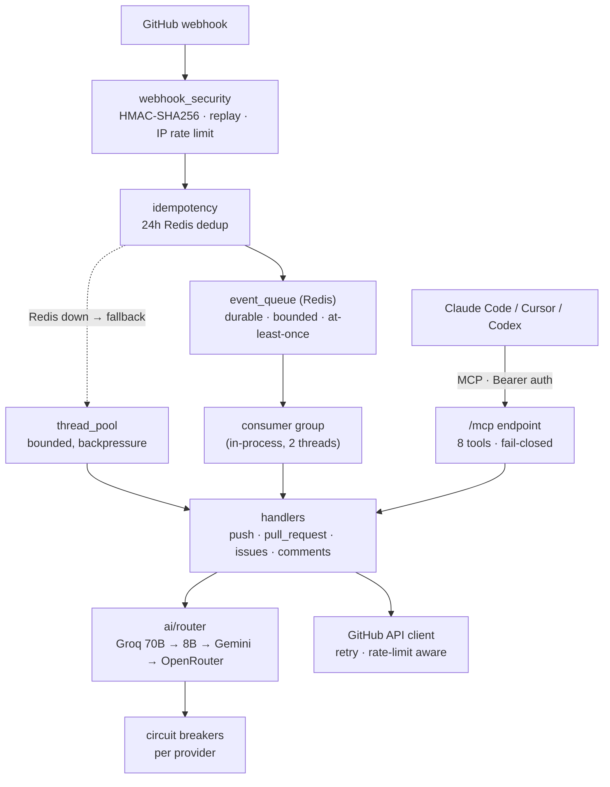

<div align="center">


# GitHub Autopilot

**Your repository's AI co-pilot. Fix bugs, review PRs, scan secrets — from a single comment.**

**The self-hosted one**: runs on your own free-tier infra, and in
[local-LLM mode](#private-mode--keep-code-on-your-own-hardware) your code
**never leaves your hardware** — the private-repo alternative to SaaS review bots.

[](https://github.com/Shweta-Mishra-ai/github-autopilot/actions/workflows/ci.yml)
[](https://python.org)
[](https://github.com/Shweta-Mishra-ai/github-autopilot/actions/workflows/ci.yml)
[](https://github.com/Shweta-Mishra-ai/github-autopilot/actions/workflows/keepalive.yml)
[](docs/mcp-setup.md)
[](LICENSE)
[](https://render.com/deploy)
[](https://github.com/sponsors/Shweta-Mishra-ai)


<sub>*Simulated output for illustration — see the [eval suite](evals/) for measured behaviour.*</sub>

</div>

---

## Why Autopilot?

| | |
|---|---|
| ⚡ **26 slash commands** | `/fix` `/security` `/merge` `/autofix` `/rollback` … right in issue/PR comments |
| 🛡️ **Safety-first automation** | Confidence gates, guardrails, human-in-the-loop `/apply`, maintainer-only permissions |
| 🔁 **Durable event queue** | Webhooks parked in Redis — survive restarts, deploys and crashes; if Redis itself dies, degrades to best-effort in-process dispatch (and says so in the logs) |
| 🧠 **5-provider AI failover** | Groq 70B → Groq 8B → Gemini → OpenRouter, with per-provider circuit breakers |
| 🔒 **Local-LLM privacy mode** | Run on your own Ollama — set `LLM_LOCAL_ONLY=1` and code **never** leaves your infra |
| 🧩 **Private repo memory** | Learns your repo's fixes & decisions; sensitive context stays local, [encrypted backup](docs/ai-system/memory.md) for durability |
| 🔐 **Security scanning** | Secret detection on **every push to every branch**, dependency CVE checks |
| 📍 **Inline PR reviews** | Findings land as line-anchored review comments with committable suggestions — not a wall-of-text comment |
| 📏 **Honest AI output** | Every comment discloses which model wrote it; optional [quality floor](#changelog) refuses to degrade reviews to a small model; [measured by evals](evals/), not vibes |
| 🔌 **MCP server built in** | Call Autopilot tools from Claude Code, Cursor, or Codex — [setup guide](docs/mcp-setup.md) |
| 📊 **Live ops dashboard** | `/dashboard` — queue depth, event throughput, provider circuit-breakers, thread pool. Zero build, no CDN |
| 💸 **Runs on free tier** | Render free web service + free Redis. $0/month |

---

## Quickstart — deploy in 10 minutes

### 1. Create a GitHub App

1. **github.com/settings/apps** → New GitHub App
2. Webhook URL: `https://github-autopilot-1.onrender.com/webhook`
3. Webhook secret: `python3 -c "import secrets; print(secrets.token_hex(32))"`
4. Permissions: Issues ✏️ · Pull requests ✏️ · Contents ✏️ · Actions ✏️
5. Subscribe to: Push · Pull request · Issue comment · Issues
6. Download the private key (`.pem`)

### 2. Deploy

[](https://render.com/deploy)

Or manually: fork this repo → Render → **New Blueprint** → connect fork ([render.yaml](render.yaml) does the rest).

### 3. Environment variables

| Variable | Where to get it | Required |
|----------|----------------|----------|
| `GITHUB_APP_ID` | App settings page (numeric ID) | ✅ |
| `GITHUB_PRIVATE_KEY` | Contents of the `.pem` file | ✅ |
| `GITHUB_WEBHOOK_SECRET` | The secret from step 1 | ✅ |
| `GROQ_API_KEY` | [console.groq.com](https://console.groq.com) — free | ✅ |
| `REDIS_URL` | Auto-wired by render.yaml | ✅ |
| `MCP_API_KEY` | `python3 -c "import secrets; print(secrets.token_hex(32))"` | for MCP |
| `METRICS_AUTH_TOKEN` | Any strong random string | recommended |
| `GEMINI_API_KEY` / `OPENROUTER_API_KEY` | Optional extra AI fallbacks | optional |

### 4. Install & verify

Install the GitHub App on your repos, then:

```bash
curl https://github-autopilot-1.onrender.com/ping
# → {"status": "ok", "version": "6.2.0"}
```

> **Cold starts** — the demo instance runs on Render's free tier. A scheduled
> [keep-alive workflow](.github/workflows/keepalive.yml) pings it every 10 minutes
> to keep it warm (the badge above goes red if production is actually down), but if
> a ping window is missed the first request can take **~50 s** while the instance
> wakes. If a request stalls, retry once.

Comment `/health` on any issue. The bot replies with a repo health grade. Done. ✈️

---

## Commands

Type any of these in a GitHub issue or PR comment:

| Command | Description | Who |
|---------|-------------|-----|
| `/fix` | AI bug fix with root cause + test | Anyone |
| `/explain` | Plain-English explanation | Anyone |
| `/improve` | Concrete improvement suggestions | Anyone |
| `/test` | Generate pytest test cases | Anyone |
| `/docs` | Generate docstrings + README section | Anyone |
| `/refactor` | Refactoring with before/after | Anyone |
| `/perf` | Performance analysis (O(n²), N+1, …) | Anyone |
| `/gaps` | Test coverage gap analysis | Anyone |
| `/arch` | Architecture review | Anyone |
| `/ci` | Analyze CI failure | Anyone |
| `/security` | Secret + dependency scan on PR | Anyone |
| `/secfull` | Full repo security scan | Maintainers |
| `/health` | Repo health grade | Anyone |
| `/version` | Tags, releases, recent commits | Anyone |
| `/summarize` | Summarize issue thread | Anyone |
| `/budget` | Today's AI token usage | Anyone |
| `/report` | Weekly analytics | Anyone |
| `/changelog` | Generate CHANGELOG entry | Anyone |
| `/impact` | PR blast radius analysis | Anyone |
| `/merge` | Merge PR after checks pass | Maintainers |
| `/apply` | Open PR from autofix branch | Maintainers |
| `/rollback N` | Restore to snapshot N | Maintainers |
| `/release` | Draft GitHub release | Maintainers |
| `/runtests` | Trigger CI workflow | Maintainers |
| `/notify` | Send Discord/Slack alert | Maintainers |
| `/autofix` | Auto-apply code improvements (human-confirmed via `/apply`) | Maintainers |

---

## Architecture



**The queue is the backbone.** Every webhook is parked in Redis *before* the
`202` ACK, then consumed by an in-process worker group:

- **Durable** — deploys/restarts/crashes don't lose events; stranded work is requeued at boot, poison events dead-letter after 2 attempts
- **Bounded** — queue capped at 200 events, envelopes at 512KB, dead-letter at 50: nothing grows unbounded on a 512MB / 25MB-Redis free tier
- **Backpressured** — queue full → `503` → GitHub redelivers automatically
- **Degradable** — Redis down → automatic fallback to the bounded thread pool (reduced durability, still working)
- **Scale-ready** — need more throughput later? Run [`worker.py`](worker.py) as a Render worker service and set `EVENT_QUEUE_CONSUMERS=0` on web. Zero code changes.

**Other key decisions:**

- Idempotency keys live 24h — matches GitHub's webhook retry window
- Redis runs `noeviction` — dedup/queue keys are never silently evicted
- MCP + `/metrics` auth fail **closed** with constant-time compares
- Secret scanning runs on all branches, not just main
- Confidence gates: every automated action needs a per-action threshold (e.g. auto-merge ≥ 0.95)

---

## Use it from your IDE (MCP)

Autopilot ships an MCP server — analyze PRs, scan secrets, and generate tests
from Claude Code, Cursor, or Codex without leaving your editor:

```bash
claude mcp add --transport http github-autopilot \
  https://github-autopilot-1.onrender.com/mcp \
  --header "Authorization: Bearer YOUR_MCP_API_KEY"
```

Full client configs, tool reference, and troubleshooting: **[docs/mcp-setup.md](docs/mcp-setup.md)**

---

## Use it from your IDE (Claude Code plugin)

Install the commands + MCP server in one step:

```
/plugin marketplace add Shweta-Mishra-ai/github-autopilot
/plugin install github-autopilot
```

Point it at your deployed instance:

```bash
export GITHUB_AUTOPILOT_URL="https://github-autopilot-1.onrender.com/mcp"
export MCP_API_KEY="<your server's MCP_API_KEY>"
```

Then, from Claude Code: `/github-autopilot:review owner/repo 42` ·
`/github-autopilot:fix owner/repo 17` · `/github-autopilot:security file.py` ·
`/github-autopilot:health owner/repo`. Full details in [`plugin/README.md`](plugin/README.md).

---

## Private mode — keep code on your own hardware

By default the bot sends code to Groq/Gemini/OpenRouter. For private or
regulated repos, point it at a local [Ollama](https://ollama.com) instead —
source code never leaves your infrastructure:

```bash
ollama pull llama3.1:8b
```

```bash
OLLAMA_HOST=http://localhost:11434
OLLAMA_MODEL=llama3.1:8b
LLM_LOCAL_ONLY=1     # Ollama or nothing — no cloud provider is ever contacted
# LLM_PREFER_LOCAL=1 # softer: try local first, fall back to cloud on failure
```

In `LLM_LOCAL_ONLY` mode the router **fails closed** — if Ollama is down, calls
error out rather than silently leaking to a cloud API. `cost_usd` is always `0`.

---

## Configuration

Drop `.ai-repo-manager.yml` in your repo root (the filename predates the
GitHub Autopilot rename and is kept so existing installs don't break):

```yaml
push:
  scan_secrets: true          # always on for all branches
  scan_dependencies: true

confidence:
  thresholds:
    auto_merge: 0.95
    fix_command: 0.75

commands:
  permissions:
    maintainer_only: [merge, rollback, release]

bot:
  footer: "*Powered by GitHub Autopilot*"
```

All keys are validated on load — bad values log a warning and fall back to safe defaults.

---

## Local development

```bash
git clone https://github.com/Shweta-Mishra-ai/github-autopilot.git
cd github-autopilot
python -m venv .venv && source .venv/bin/activate
pip install -r requirements-dev.txt
cp .env.example .env          # fill in your credentials
python server.py
```

```bash
pytest tests/ -v              # 840+ tests, ~75% coverage — exact count lives in the CI badge
ruff check app/               # lint
```

---

## Security model

- **Fail closed everywhere it matters**: unset webhook secret → boot refuses; unset `MCP_API_KEY` → MCP returns 503; token compares are constant-time
- HMAC-SHA256 signature verification on every webhook, replay + IP rate limiting (spoof-resistant)
- Autofix cannot touch CI workflows, Dockerfiles, env files, or security modules (path allowlist + prefix blocklist + traversal guard); changes require human `/apply`
- Optional `MCP_ALLOWED_INSTALLATIONS` allowlist for tenant isolation
- Bot-loop prevention on all event handlers
- Prompt-injection mitigation: input sanitization + delimiter-wrapped user content
- **No code-execution path**: the bot never runs untrusted repo code (no `eval`/`exec`/`subprocess`/`pickle`) — a malicious repo cannot execute code on the host

Full analysis: [reliability & isolation audit](docs/architecture/reliability-audit.md) · where we're headed: [roadmap](docs/architecture/roadmap.md).

Found a vulnerability? Please email rather than opening a public issue.

---

## Changelog

### V6.2.0 — 2026-07-11
- **Inline PR reviews**: findings now post as a real GitHub Review with line-anchored comments, snapped onto actual diff lines, with committable ```suggestion blocks for safe single-line fixes. Automatic fallback to the classic issue comment if the Reviews API rejects a payload — a mapping bug can never lose a review.
- **AI evals** ([evals/](evals/)): golden issues + PR diffs with planted bugs (SQL injection, hardcoded secret, N+1, path traversal, plus a clean-diff over-flagging check), pushed through the *real* production code paths and scored deterministically. Manual `Evals` workflow in Actions.
- **Model disclosure**: every bot comment states which model produced it. **Quality floor** (`LLM_QUALITY_FLOOR=high`): reviews/fixes refuse to run on a basic-tier model instead of silently degrading to 8B.
- **Learning loop finally wired** (shipped unit-tested-but-unused in V6.0): `/apply` and merging a bot autofix branch now record acceptance; future `/fix` prompts inject the learned repo conventions.
- **Command rate limit enforced during Redis outages** (was fail-open) via a bounded in-memory window. **MCP named API keys** (`MCP_API_KEYS=laptop:tok1,ci:tok2`) with per-client revocation and an attributable audit log. **Redis memory watermark** on `/health` (the 25MB free tier fails writes when full — now visible before it bites).
- Honesty pass: durability claim corrected (Redis-down fallback is best-effort and now says so), demo labeled as simulated, `/` endpoint no longer reports the pre-rename app name.

### V6.1.1 — 2026-07-10
- **Honest badges**: the "tests: N passing" badge is now generated by CI itself — a `badges` job counts the passes from a real run on `main` and publishes the number; it can no longer drift from reality. New **Server Health** badge backed by a scheduled production ping.
- **No more cold-start surprises**: keep-alive workflow pings production every 10 minutes (Render free tier sleeps at 15 min idle) and turns red + emails the owner if the server is actually down. README now states the ~50 s cold-start worst case explicitly.
- **Event-queue fixes** (PR #69): eliminated constant "Timeout reading from socket" log spam, fixed a `TypeError` crash in confidence-gated `pull_request` handling, and a deadlock in `get_redis_blocking()`.
- Docker cleanup: removed a stale ChromaDB/SQLite `mkdir` from the Dockerfile and unused `SCHEDULED_*` env vars from docker-compose (that cron handler was deleted in V6.1.0).

### V6.1.0 — 2026-07-05
- **Live-validated, not just mock-tested**: booted the real app and drove it — real HMAC-signed webhooks through the full dispatch pipeline, `LLM_LOCAL_ONLY` refusing a genuinely unreachable network target, a full memory → encrypted-backup → restore round trip with an explicit no-plaintext-in-ciphertext assertion. Two real bugs found and fixed during this process: a duplicate/ungated release workflow, and the secret scanner flagging its own test fixtures.
- **+84 tests** (732 → 816): full integration coverage for the webhook pipeline, the local-LLM privacy guarantee, the comment-dispatch entry point (all 25 commands' routing verified), the GitHub Security API reader, and Slack/Discord notifications. Coverage 65% → 75%.
- **Two dead files removed** (verified via grep, not assumed): the pre-router V4 LLM client and an unwired V3 cron handler.
- Documentation corrected to match reality: the testing guide referenced a test file that no longer existed and a CI config that didn't match `.github/workflows/ci.yml`; both rewritten from verified values.

### V6.0.0 — 2026-07-04
- **Durable Redis event queue** — webhooks survive restarts; bounded, at-least-once, dead-letter, thread-pool fallback
- **Fail-closed MCP auth** + constant-time token compares + installation allowlist
- **Local-LLM privacy mode** (Ollama) — code never leaves your infra
- **Private repo memory** — explainable ("knows why") + encrypted backup
- **Live ops dashboard** (`/dashboard`) and **Claude Code plugin + marketplace**
- **Observability** — boot warnings for missing auth tokens; silent optional-path failures now instrumented
- **Maintainability** — `mcp_server.py` split into `tools.py` / `handlers.py` / dispatch
- Version single source of truth; config cross-tenant leak fixed; dead code purged
- Pro README, logo, animated demo, MCP setup guide, [reliability audit](docs/architecture/reliability-audit.md) + [roadmap](docs/architecture/roadmap.md)

### V5.0.0
- `comments.py` → `comments/` package (5 focused modules)
- Redis connection pooling, secret scanning on all branches
- LLM circuit breakers with automatic failover
- MCP server for IDE integrations · per-repo YAML config

---

## Support

Free and open source. If you'd like to support development, sponsorship is
available via [GitHub Sponsors](https://github.com/sponsors/Shweta-Mishra-ai) —
entirely optional.

---

<div align="center">

Built by [Shweta Mishra](https://github.com/Shweta-Mishra-ai) · MIT License

⭐ Star this repo if Autopilot saved you time!

</div>
